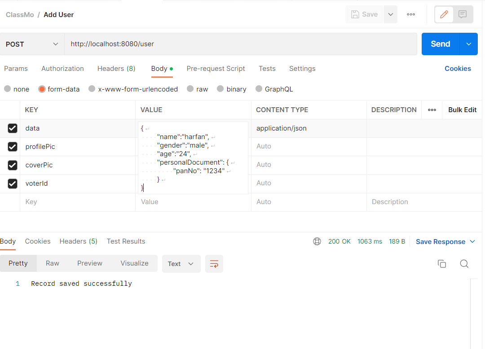
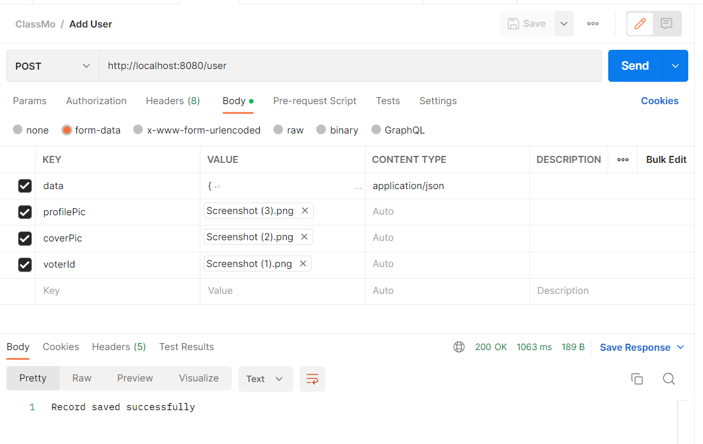
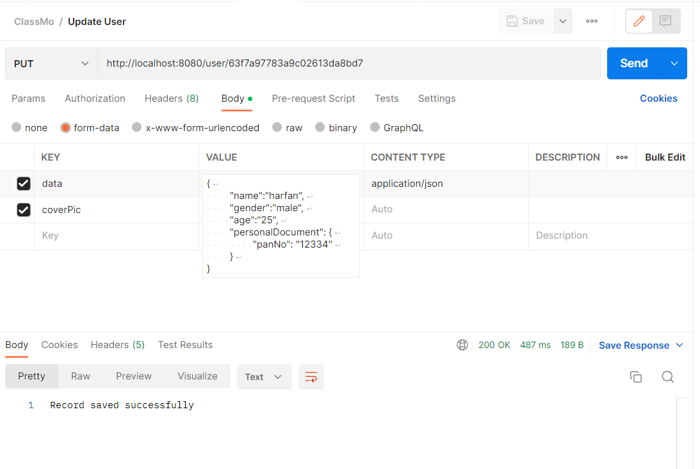
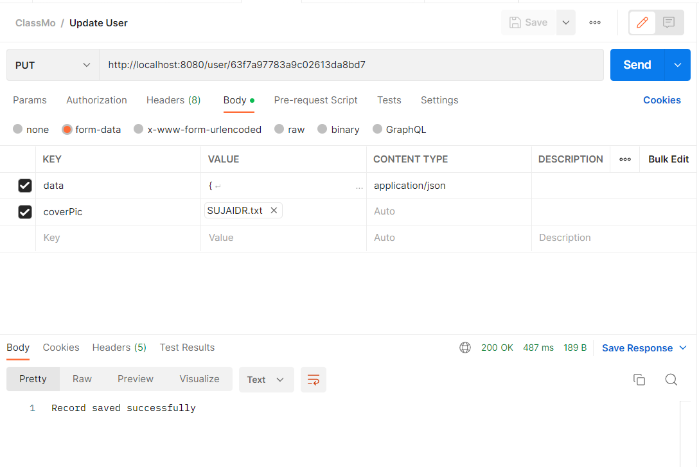
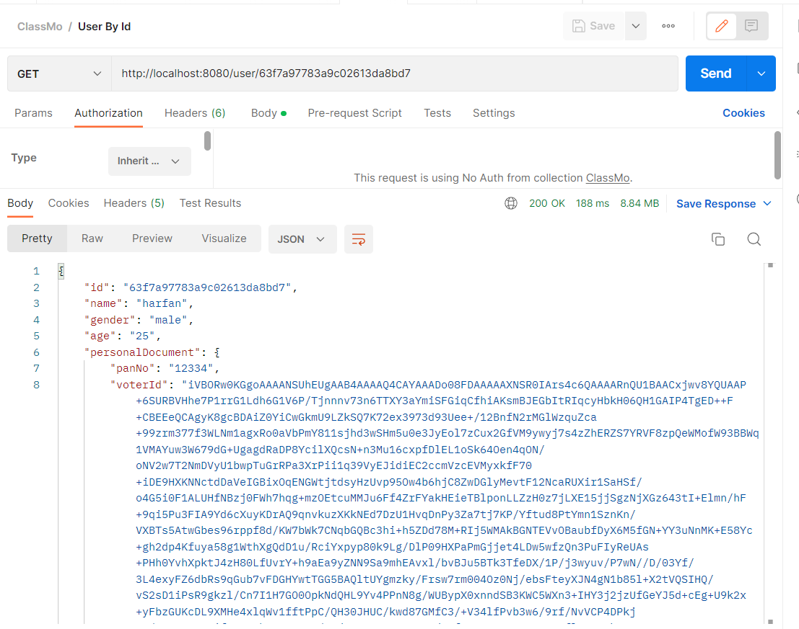
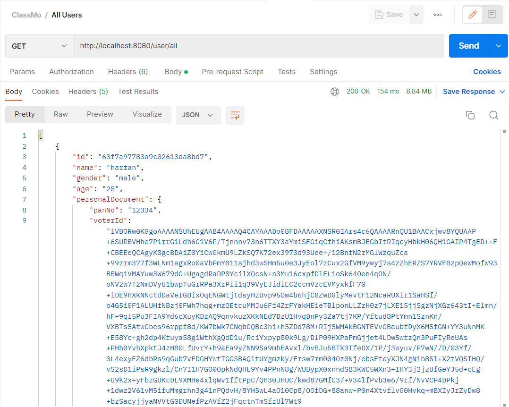

# File Uploading with Spring, Kotlin, and MongoDB
#### This project demonstrates how to implement file uploading using the Spring framework, Kotlin, and MongoDB.

#### Prerequisites
1. Java 8 or higher
2. MongoDB installed and running on your local machine (or a remote instance with proper credentials)

#### Technologies used
1. Spring Boot
2. Kotlin
3. MongoDB
4. Gradle

#### Setup
1. Clone the repository
2. Open the project in your favorite IDE
3. Configure the MongoDB connection properties in the application.properties file.
4. Run the project using bootRun
5. Access the application at http://localhost:8080

#### Endpoints
1. POST /users - Upload a user which has file and json array
2. GET /users/all - Retrieve a list of all users
3. GET /users/{id} - Retrieve a specific user by ID
4. PUT /users/{id} - Update a specific user by ID
5. DELETE /users/{id} - Delete a specific file by ID

### Example Usage
In this project, we are implementing a method for uploading both a file and a JSON payload in a single request using form-data. This approach can be useful when you need to associate metadata or other data with the file being uploaded.

To upload both a file and JSON in a single request using form-data, follow these steps:

1. Open your preferred HTTP client, such as Postman, and create a new request.
2. Set the request method to POST and the request URL to the endpoint for file upload.
3. In the request body, select the form-data option.
4. Add two fields to the form-data: one for the file and another for the JSON payload.
5. For the file field, set the key to file, and set the value to the file you wish to upload.
6. For the JSON field, set the key to json, and set the value to the JSON payload you wish to upload.
7. Ensure that the Content-Type header is set to application.json for json body.

Here is an example of what the request might look like in Postman:

  
  

By following these steps, you can successfully upload a file and a JSON payload in a single form-data request.

#### Below are examples of GET, PUT

  
  
  
  

#### References
1. Spring Boot documentation
2. MongoDB documentation
3. Kotlin documentation